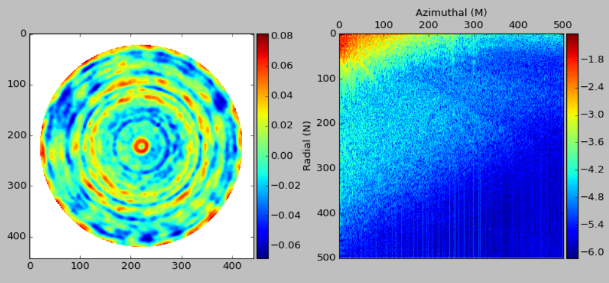
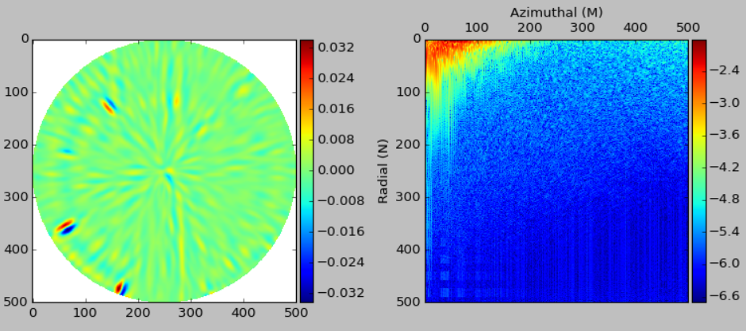

===========
Scikit-Qfit
===========

.. note::
   Work in progress - automodule issue with reathedocs
   
A gradient-orthogonal Q-polynomial representation of axially symmetric optical surfaces has been used for several
years by designers.  It improves upon the standard polynomial form by being simpler to interpret, using fewer
terms to adequately define a surface, and sometimes even offering quicker convergence in design optimization.
Q-polynomials were first introduced with the publication of:

 * G W Forbes,  `Shape specification for axially symmetric optical surfaces <https://www.osapublishing.org/oe/abstract.cfm?uri=oe-15-8-5218>`_, Opt. Express 15, 5218-5226 (2007)

The use of Q-polynomials was extended, by the original author, to address freeform shapes through the following articles:

 * `Fitting freeform shapes with orthogonal bases <https://www.osapublishing.org/oe/abstract.cfm?uri=oe-21-16-19061>`_, Opt. Express 21, 19061-19081 (2013)
 * `Characterizing the shape of freeform optics <https://www.osapublishing.org/oe/abstract.cfm?uri=oe-20-3-2483>`_, Opt. Express 20(3), 2483-2499 (2012)
 * `Robust, efficient computational methods for axially symmetric optical aspheres <https://www.osapublishing.org/oe/abstract.cfm?uri=oe-18-19-19700>`_, Opt. Express 18(19), 19700-19712 (2010)

The implementation of this package follows the description in "Fitting freeform shapes with orthogonal
bases".

Q-spectrum examples
===================

The Q-spectrum offers a natural way to quantify and investigate surface structure on parts with circular apertures.
For example, spoke structure on the surface appears in specific columns of the spectrum whereas raster patterns appear
as diagonal bands with a slope of one half.  Rotationally symmetric structure, such a rings etc., are all contained in
the m=0 column.  The spectrum is computed with an FFT-like step that suffers similarly from aliasing unless a
sufficiently large range of frequencies is computed.

The above images were generated from data supplied by `Mahr GmbH <http://www.mahr.com/>`_.

Code structure
==============

The package only contains two modules. The Jacobi module provides support for normalised Jacobi
polynomials that extend the range of usable parameters before an overflow condition is encountered.
Even though the Q-fitting algorithm is procedural the implementation is via a Q-spectrum class as it allowed
the spectrum to be iterated with different parameters without having to reload the data.
The algorithm implementation refers to the relevant section of the reference documents.

.. toctree::
   :maxdepth: 2

   Jacobi polynomials <api/skqfit.asmjacp>
   Q-spectrum <api/skqfit.qspectre>

Installation
============

Quick Installation
------------------
If you have `pip <http://pypi.python.org/pypi/pip>`_ installed, you should be
able to install the latest stable release of ``scikit-qfit`` by running the
following::

   pip install scikit-qfit

Latest Software
---------------
The latest software can be downloaded from `GitHub <https://github.com/npdata/scikit-qfit>`_

Online documentation is available at `<https://scikit-qfit.readthedocs.org>`_

Installation Dependencies
-------------------------
``scikit-qfit`` requires that the following software packages be
installed:

* `Python <http://www.python.org>`_ 2.7.6 or later.
* `NumPy <http://www.numpy.org>`_ 1.8.2 or later.
* `SciPy <http://www.scipy.org>`_ 0.13.3 or later.

Contents
========

.. toctree::
   :maxdepth: 2

   Module Reference <api/modules>
   License <license>
   Authors <authors>
   Changelog <changes>

Indices and tables
==================

* :ref:`genindex`
* :ref:`modindex`
* :ref:`search`
